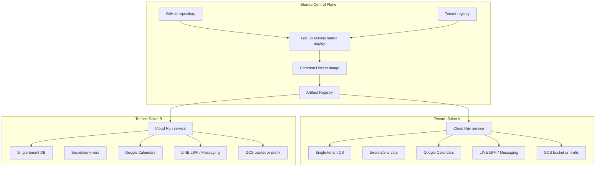
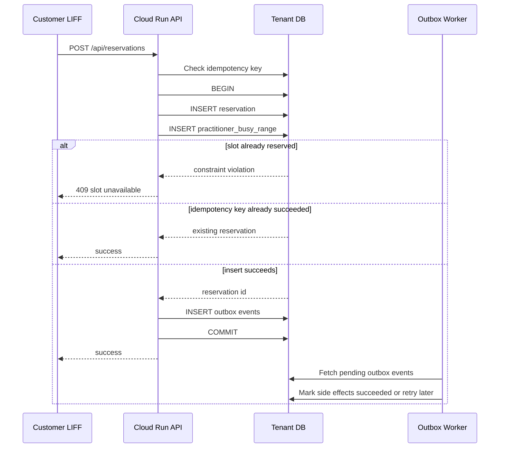
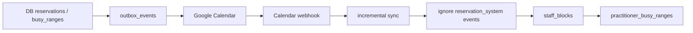

# シングルテナント予約システム 設計・要件定義書

作成日: 2026-05-12
最終更新日: 2026-05-13
ステータス: Draft v0.6
対象読者: 将来の開発者、引き継ぎを受けるエンジニア、運用担当者

## 1. 目的

美容サロン向け予約システムを、サロンごとに独立した環境として提供するための設計方針を定義する。

本システムは、まだ契約サロンがない状態から1件目の導入を目指している。今後サロン数が増えても、コードのコピー、手作業の環境作成、サロンごとの場当たり的な分岐で破綻しないように、最初から以下を設計原則にする。

- コードは1リポジトリ、デプロイ先はサロンごとに分離する。
- 各サロンのデータは物理的または論理的に独立させる。
- 新規サロン追加は、最終的にスクリプトまたはIaCで再現可能にする。
- 予約の整合性はDB制約で守り、アプリの事前チェックだけに依存しない。
- Google Sheetsは初期移行後に正本から外し、DBを予約データの正本にする。
- 予約は顧客LIFFまたはスタッフ/管理画面から作成し、Google Calendarからは作成しない。
- Google Calendarは予約確認用の外部カレンダーとして使い、休憩・私用・指名不可などの予約不可ブロック入力だけを許可する。
- Google Calendarで作成された休憩・私用・指名不可はDBへ同期し、`staff_blocks` として扱う。
- 予約とスタッフブロックの共通占有時間は `practitioner_busy_ranges` に集約し、DB制約で重複を防ぐ。
- 予約作成API、Google Calendar作成、LINE通知には冪等性を持たせる。
- 本番の機密値はCloud Runの通常環境変数ではなくSecret Managerで管理する。

## 2. 背景

当初はGoogle SheetsをDB的に使う構成でもMVPは成立する。ただし、予約システムではダブルブッキングが致命的であり、SheetsやCalendar APIの事前チェックだけでは同時予約を完全には防げない。

マルチテナント構成にすると、DBの全テーブルに `tenant_id` が必要になり、認証、認可、RLS、テナント境界のテスト、テナントごとの表示制御が複雑になる。美容サロン向けBtoBで、初期の顧客数が少なく、サロンごとの独立性やカスタマイズ性を重視する段階では、シングルテナント構成の方が実装と運用のバランスが良い。

ここでいうシングルテナントは、サロンごとにコードをコピーするという意味ではない。共通コードを1つ持ち、環境変数、DB、外部連携設定、デプロイ先だけをサロンごとに分ける。

## 3. 現状整理

リポジトリ: `/Users/shotahorie/dev/github/shota-0712/reservation-system-multi`

### 3.1 現在の技術構成

| 項目 | 現状 |
| --- | --- |
| Backend | Node.js, Express, CommonJS |
| Frontend | `backend/public/index.html` の単一HTMLアプリ |
| Hosting | Cloud Run |
| CI/CD | GitHub Actions |
| データ保存 | Google Sheets |
| 空き状況・予約反映 | Google Calendar。現在はCalendarが予約可否判定にも強く関与 |
| 認証 | LINE LIFF, LINE User ID |
| 管理者判定 | `ADMIN_LINE_ID` 環境変数。実装上はカンマ区切りで複数管理者に対応済み |
| 通知 | LINE Messaging API |
| 画像保存 | Google Cloud Storage |
| バッチ | `POST /api/batch/reminders` をSchedulerから呼ぶ想定 |

### 3.2 現在の主要データソース

Google Sheets内の想定シート:

| シート | 用途 |
| --- | --- |
| `menus` | メニュー、カテゴリ、施術時間、価格、画像、並び順、紐づくオプション |
| `reservations` | 予約履歴、LINE ID、名前、日付、時刻、ステータス、Calendar event ID |
| `practitioners` | 施術者、Google Calendar ID、プロフィール、画像、指名料 |
| `options` | 追加オプション、時間、価格、説明、有効フラグ |
| `settings` | サロン名、住所、営業時間、休業日、注意事項、ロゴURL |

### 3.3 現在できていること

- 顧客向け予約フロー
  - メニュー選択
  - オプション選択
  - 施術者選択または指名なし
  - 日時選択
  - 予約作成
  - 予約変更
  - 予約キャンセル
- 管理者向け機能
  - メニューCRUD
  - メニュー並び替え
  - 施術者CRUD
  - オプションCRUD
  - 設定更新
  - 全予約一覧
  - 管理者キャンセル
  - 画像アップロード
- 外部連携
  - Google Calendarへの予約イベント作成・削除
  - LINEへの予約完了、変更、キャンセル、リマインダー通知
  - GCSへの画像保存
- デプロイ
  - `main` pushでDocker build、Artifact Registry push、Cloud Run deploy
  - Cloud Run環境変数でサロンごとの設定を注入

### 3.4 現状の課題

| 課題 | 内容 | 影響 |
| --- | --- | --- |
| 予約の同時実行制御 | `checkConflict -> createEvent -> sheets.addReservation` が一つのトランザクションではない | 同じ枠が同時に予約される可能性 |
| Sheetsが予約の正本 | Sheetsには排他制約、外部キー、トランザクション設計がない | 整合性をアプリ側で抱え込む |
| Calendarが予約判定に強く依存 | Google Calendarは予約確認やブロック入力には便利だが、予約成立の正本やDB制約の置き場には向かない | API失敗時や手動編集時の整合性が弱い |
| テナント追加手順が未整備 | サロン追加時に何を複製・作成・設定するかがコード化されていない | 2件目以降で手作業ミスが増える |
| GitHub Actionsが単一サービス前提 | `SERVICE_NAME` など単一テナント分のSecretsを参照している | 複数サロンへの一括デプロイに向かない |
| 監視・台帳がない | どのサロンがどのURL/DB/LINE設定かを追跡する仕組みがない | 障害対応、更新、契約終了が難しくなる |

## 4. 基本方針

### 4.1 採用するテナンシーモデル

サロンごとに以下を分離する「シングルテナント・サイロ型」を採用する。

- Cloud Run service
- DB
- LINE LIFF / Messaging API設定
- Google Calendar。予約確認用の外部カレンダー、かつ休憩・私用・指名不可などのブロック入力元として使う
- サロン設定
- 必要に応じてGCS bucketまたはprefix

ただし、以下は共通化する。

- GitHubリポジトリ
- Docker image
- CI/CD workflow
- DB migration
- テナント作成スクリプト
- IaC module

### 4.2 コード管理

サロンごとにリポジトリ、ブランチ、ディレクトリコピーを作らない。

悪い例:

```text
reservation-system-salon-a/
reservation-system-salon-b/
reservation-system-salon-c/
```

良い例:

```text
reservation-system-multi/
  backend/
  db/
    migrations/
    seed/
  infrastructure/
    modules/
      tenant/
    tenants/
      salon-a.yaml
      salon-b.yaml
  scripts/
    provision-tenant.sh
    deploy-tenant.sh
    migrate-tenant.sh
  docs/
```

サロン差分は設定データとして管理する。コード中に `if (salon === 'salon-a')` のような分岐を増やさない。

### 4.3 コントロールプレーン

テナント環境を増やすには、全サロンを把握する台帳が必要になる。

最初はGit管理されたYAMLまたはGoogle Sheetsでよい。将来的には管理画面化する。

例:

```yaml
id: salon-a
name: A美容室
plan: pilot
status: active
region: asia-northeast1
cloudRunService: reservation-salon-a
databaseProvider: neon
databaseProjectId: xxx
googleSheetId: xxx
liffId: xxx
lineChannelName: A美容室公式LINE
adminLineIds:
  - Uxxxxxxxx
theme:
  color: "#9b1c2c"
```

コントロールプレーンが管理するもの:

- テナントID
- サロン名
- 契約状態
- Cloud Run URL
- DB接続先
- LINE/LIFF設定
- Calendar ID
- 管理者LINE ID
- デプロイ対象かどうか
- 最終デプロイバージョン

## 5. 要件

### 5.1 機能要件

顧客向け:

- LINE LIFFから予約画面を開ける。
- メニュー、オプション、施術者、日時を選択できる。
- 指名なしの場合、空いている施術者を自動割当できる。
- 予約作成後、顧客にLINE通知を送る。
- 予約履歴を確認できる。
- 予約日時の24時間前までは変更・キャンセルできる。
- 前日リマインダーを送信できる。

管理者向け:

- 管理者はLINE User IDで判定する。
- メニュー、オプション、施術者、店舗設定を管理できる。
- 予約一覧を確認できる。
- 管理者都合で予約をキャンセルできる。
- メニュー画像、ロゴ画像をアップロードできる。

テナント管理:

- 新規サロン追加時に、共通コードをコピーせず新しい環境を作成できる。
- サロンごとの環境変数、Secrets、DB、LIFF、Calendarを管理できる。
- 全サロンへ同一バージョンを順次デプロイできる。
- 契約終了時に、そのサロンのデータエクスポートと環境停止ができる。

### 5.2 非機能要件

| 要件 | 内容 |
| --- | --- |
| 整合性 | 同一施術者・同一時間帯の予約重複をDB制約で防ぐ |
| 分離性 | あるサロンのDBには他サロンのデータを入れない |
| 可用性 | Google CalendarやLINE通知の一時失敗で予約DBの整合性を壊さない |
| 再現性 | テナント環境作成を手順書だけでなくスクリプト/IaCに寄せる |
| 移植性 | 特定PaaSに依存しすぎず、Postgres標準機能を中心にする |
| 監査性 | 予約作成、変更、キャンセル、管理者操作の履歴を残す |
| セキュリティ | DB URL、LINE token、Scheduler secretはSecret Managerで管理する |
| 保守性 | サロン固有処理はコード分岐ではなく設定で表現する |
| コスト | 1サロン目は低コストで開始し、サロン数に応じて段階的に増やす |

## 6. 目標アーキテクチャ



### 6.1 予約作成の目標フロー

予約DBを正本にする。



重要な考え方:

- 予約確定は `reservations` と `practitioner_busy_ranges` のinsert成功で判断する。
- Google Calendar作成やLINE通知は、outbox workerが処理する予約確定後の副作用として扱う。
- Calendar/LINEが失敗しても予約DBは正しい状態を保つ。
- 失敗した副作用は `outbox_events` に残し、再試行できるようにする。
- LIFFの二重送信や通信再送に備え、予約作成は `line_user_id + idempotency_key` で冪等にする。
- 同じ予約に対するCalendarイベントが複数作られないよう、Calendar event IDも予約IDから決定的に生成する。

## 7. DB選定

DBは全データ移行を前提に比較する。`reservations` だけではなく、将来的には `menus`, `options`, `practitioners`, `settings` もDBを正本にする。

2026-05-13時点の公式情報をもとにした比較:

| 候補 | 種別 | 強み | 弱み | 評価 |
| --- | --- | --- | --- | --- |
| Neon | Serverless Postgres | Postgres標準機能、EXCLUDE制約、サーバーレス、プロジェクト分離、低コスト開始。Neon Docsでも多くの用途でアプリまたは顧客ごとのプロジェクト作成が案内されている | Supabaseほど業務向けダッシュボードが豊富ではない | 第一候補 |
| Supabase | Managed Postgres + BaaS | Postgres、管理画面、Auth/Realtime/Storage込み、サロンに見せやすい | Free projectは1週間非アクティブでpauseされ、Freeのactive project数にも制限がある。複数サロン本番運用では料金設計に注意 | 第二候補 |
| Cloudflare D1 | Serverless SQLite | 安い、DBを多数作りやすい、Workersと相性が良い。D1 Docsでは多数DBを作れる分離用途が案内されている | SQLiteベースのためPostgresの範囲型・EXCLUDE制約が使えない。現在のCloud Run構成からは移行範囲が大きい | Cloudflare Workersへ寄せる場合の候補 |
| Cloudflare Durable Objects + SQLite | Stateful Worker + SQLite | テナント単位の直列化、調整処理に強い | アプリ構成をWorkers中心に作り直す必要がある | 将来検討 |
| Cloud SQL for PostgreSQL | GCP Managed Postgres | GCP内で完結、安定、Postgres制約が使える | サロンごとに分けると固定費が重い | 規模拡大後または法人要件向け |

### 7.1 推奨

現時点の推奨は Neon + Cloud Run + Postgres migration である。

理由:

- ダブルブッキング防止にPostgresの排他制約を使える。
- Cloud Runと同じく、利用が少ない初期でもコストを抑えやすい。
- サロンごとにDBプロジェクトまたはDBを分けやすい。
- 将来Cloud SQLやSupabase Postgresへ移す場合も、Postgres中心の設計なら移行しやすい。
- Cloudflare D1よりも、予約時間の重複制約をDBレベルで表現しやすい。

Cloudflareを使いたい場合は、いきなりD1へ寄せるより、まずCloudflareをフロント配信、DNS、WAF、将来のWorkers用途で使い、DBはPostgresにする方が移行リスクが低い。Workersへ移行する場合でも、Cloudflare Hyperdrive経由でPostgresへ接続する構成が取れる。

## 8. DB設計案

### 8.1 設計原則

- DBは各サロンごとに独立させるため、基本テーブルに `tenant_id` は持たない。
- 予約、メニュー、オプション、施術者、設定はDBを正本にする。
- Google Sheetsは初期移行後、インポート/エクスポートまたは閲覧用ミラーに降格する。
- 予約は顧客LIFFまたはスタッフ/管理画面から作成し、Google Calendarから直接作成しない。
- Google Calendarは予約確認用の外部カレンダーとして扱う。
- Google Calendarで直接作成・変更・削除してよいのは、休憩・私用・指名不可などの予約不可ブロックのみとする。
- Google Calendarの手動ブロックは、webhookと差分同期で `staff_blocks` と `practitioner_busy_ranges` に取り込む。
- 予約作成・変更はDBトランザクション内で成立させる。

### 8.2 主要テーブル

| テーブル | 用途 |
| --- | --- |
| `settings` | 店舗名、住所、営業時間、休業日、注意事項、テーマ設定 |
| `business_holidays` | 臨時休業日・臨時営業日 |
| `practitioners` | 施術者、Calendar ID、プロフィール、有効フラグ |
| `menus` | メニュー、カテゴリ、施術時間、価格、説明、画像、並び順 |
| `options` | 追加オプション、施術時間、価格、有効フラグ |
| `menu_options` | メニューとオプションの紐づけ |
| `customers` | LINE User ID、名前、電話番号など |
| `reservations` | 予約本体 |
| `reservation_options` | 予約時点のオプションスナップショット |
| `staff_blocks` | スタッフ休憩、指名不可時間、Google Calendar外部予定、システムブロック |
| `practitioner_busy_ranges` | 予約とスタッフブロックを横断した施術者の占有時間。重複防止の中核 |
| `outbox_events` | Calendar反映、LINE通知などの再試行可能な副作用 |
| `calendar_sync_states` | Google Calendar差分同期のsync token、watch channel情報 |
| `calendar_sync_conflicts` | Calendar同期ラグなどで発生した予約・外部予定の衝突記録 |
| `audit_logs` | 管理者操作、予約変更、キャンセル履歴 |
| `admin_users` | 管理者LINE User ID、権限、有効フラグ |

### 8.3 予約テーブル案

Postgresの排他制約で、同一施術者の予約時間帯が重ならないようにする。

```sql
CREATE EXTENSION IF NOT EXISTS pgcrypto;
CREATE EXTENSION IF NOT EXISTS btree_gist;

CREATE TYPE reservation_status AS ENUM (
  'reserved',
  'canceled',
  'completed',
  'no_show'
);

CREATE TYPE block_source AS ENUM (
  'admin',
  'google_calendar',
  'system'
);

CREATE TYPE staff_block_status AS ENUM (
  'active',
  'canceled'
);

CREATE TYPE busy_source_type AS ENUM (
  'reservation',
  'staff_block'
);

CREATE TYPE outbox_status AS ENUM (
  'pending',
  'processing',
  'succeeded',
  'failed',
  'dead'
);

CREATE TYPE calendar_conflict_status AS ENUM (
  'open',
  'resolved',
  'ignored'
);

CREATE OR REPLACE FUNCTION set_updated_at()
RETURNS trigger AS $$
BEGIN
  NEW.updated_at = now();
  RETURN NEW;
END;
$$ LANGUAGE plpgsql;

CREATE TABLE practitioners (
  id uuid PRIMARY KEY DEFAULT gen_random_uuid(),
  name text NOT NULL,
  calendar_id text,
  image_url text,
  title text,
  sns text,
  experience text,
  nomination_fee integer NOT NULL DEFAULT 0,
  pr_title text,
  description text,
  is_active boolean NOT NULL DEFAULT true,
  sort_order integer NOT NULL DEFAULT 1000,
  created_at timestamptz NOT NULL DEFAULT now(),
  updated_at timestamptz NOT NULL DEFAULT now()
);

CREATE TABLE menus (
  id uuid PRIMARY KEY DEFAULT gen_random_uuid(),
  category text NOT NULL DEFAULT '',
  name text NOT NULL,
  minutes integer NOT NULL CHECK (minutes > 0),
  price integer NOT NULL CHECK (price >= 0),
  description text,
  image_url text,
  sort_order integer NOT NULL DEFAULT 1000,
  is_active boolean NOT NULL DEFAULT true,
  created_at timestamptz NOT NULL DEFAULT now(),
  updated_at timestamptz NOT NULL DEFAULT now()
);

CREATE TABLE customers (
  id uuid PRIMARY KEY DEFAULT gen_random_uuid(),
  line_user_id text,
  name text,
  phone text,
  created_at timestamptz NOT NULL DEFAULT now(),
  updated_at timestamptz NOT NULL DEFAULT now()
);

CREATE UNIQUE INDEX customers_line_user_id_uq
  ON customers (line_user_id)
  WHERE line_user_id IS NOT NULL;

CREATE TABLE reservations (
  id uuid PRIMARY KEY DEFAULT gen_random_uuid(),
  customer_id uuid REFERENCES customers(id),
  line_user_id text,
  idempotency_key text,
  created_via text NOT NULL DEFAULT 'customer_liff',
  customer_name text NOT NULL,
  phone text,
  practitioner_id uuid NOT NULL REFERENCES practitioners(id),
  practitioner_name_snapshot text NOT NULL,
  menu_id uuid REFERENCES menus(id),
  menu_name_snapshot text NOT NULL,
  start_at timestamptz NOT NULL,
  end_at timestamptz NOT NULL,
  time_range tstzrange GENERATED ALWAYS AS (tstzrange(start_at, end_at, '[)')) STORED,
  status reservation_status NOT NULL DEFAULT 'reserved',
  total_minutes integer NOT NULL CHECK (total_minutes > 0),
  total_price integer NOT NULL CHECK (total_price >= 0),
  calendar_event_id text,
  canceled_at timestamptz,
  cancel_reason text,
  created_at timestamptz NOT NULL DEFAULT now(),
  updated_at timestamptz NOT NULL DEFAULT now(),
  CHECK (end_at > start_at),
  CHECK (
    (created_via = 'customer_liff' AND line_user_id IS NOT NULL)
    OR
    (created_via = 'staff_admin')
  ),
  EXCLUDE USING gist (
    practitioner_id WITH =,
    time_range WITH &&
  ) WHERE (status = 'reserved')
);

CREATE INDEX reservations_start_at_idx ON reservations (start_at);
CREATE INDEX reservations_line_user_id_idx ON reservations (line_user_id);
CREATE UNIQUE INDEX reservations_line_user_id_idempotency_key_uq
  ON reservations (line_user_id, idempotency_key)
  WHERE line_user_id IS NOT NULL
    AND idempotency_key IS NOT NULL;
```

v0.6では、予約とスタッフブロックを横断した最終的な重複防止は `practitioner_busy_ranges` に集約する。`reservations` の排他制約は予約同士の追加防衛として残してもよいが、設計の中核は `practitioner_busy_ranges` である。

`status = 'reserved'` は「予約枠を占有する状態」を意味する。初期は `reserved` のみを制約対象にする。将来決済を入れて `pending_payment`, `confirmed`, `expired` を追加する場合は、枠を占有するステータスを制約対象に含める必要がある。

予約変更は、初期実装では `UPDATE reservations SET start_at = ...` ではなく「旧予約を `canceled` にする + 新予約をINSERTする」方式を推奨する。ユーザー画面では予約変更に見せても、DB上は履歴を分けた方が監査、通知、Calendar反映の扱いが単純になる。

### 8.4 スタッフブロック

スタッフ休憩、指名不可時間、外部予定、Google Calendarに手動で入れた予定は `staff_blocks` としてDBに取り込む。`staff_blocks` はブロックの詳細情報を持つテーブルであり、実際に予約不可時間として効かせるための共通占有レコードは `practitioner_busy_ranges` に作る。

```sql
CREATE TABLE staff_blocks (
  id uuid PRIMARY KEY DEFAULT gen_random_uuid(),
  practitioner_id uuid NOT NULL REFERENCES practitioners(id),
  start_at timestamptz NOT NULL,
  end_at timestamptz NOT NULL,
  time_range tstzrange GENERATED ALWAYS AS (tstzrange(start_at, end_at, '[)')) STORED,
  source block_source NOT NULL DEFAULT 'admin',
  status staff_block_status NOT NULL DEFAULT 'active',
  reason text,
  calendar_id text,
  external_event_id text,
  canceled_at timestamptz,
  created_at timestamptz NOT NULL DEFAULT now(),
  updated_at timestamptz NOT NULL DEFAULT now(),
  CHECK (end_at > start_at),
  EXCLUDE USING gist (
    practitioner_id WITH =,
    time_range WITH &&
  ) WHERE (status = 'active')
);

CREATE INDEX staff_blocks_practitioner_time_idx
  ON staff_blocks USING gist (practitioner_id, time_range);

CREATE UNIQUE INDEX staff_blocks_calendar_event_uq
  ON staff_blocks (calendar_id, external_event_id)
  WHERE source = 'google_calendar'
    AND external_event_id IS NOT NULL;
```

`staff_blocks` 側の排他制約はブロック同士の追加防衛として残してもよい。ただし、予約とブロックをまたいだ最終的な競合判定は `practitioner_busy_ranges` で行う。

### 8.5 共通占有時間

予約とスタッフブロックを別テーブルに分けるだけでは、Postgresの排他制約で `reservations` と `staff_blocks` のテーブル間競合を直接表現しにくい。そのため、施術者の占有時間を `practitioner_busy_ranges` に集約する。

```sql
CREATE TABLE practitioner_busy_ranges (
  id uuid PRIMARY KEY DEFAULT gen_random_uuid(),
  practitioner_id uuid NOT NULL REFERENCES practitioners(id),
  source_type busy_source_type NOT NULL,
  reservation_id uuid REFERENCES reservations(id),
  staff_block_id uuid REFERENCES staff_blocks(id),
  start_at timestamptz NOT NULL,
  end_at timestamptz NOT NULL,
  time_range tstzrange GENERATED ALWAYS AS (tstzrange(start_at, end_at, '[)')) STORED,
  released_at timestamptz,
  created_at timestamptz NOT NULL DEFAULT now(),
  updated_at timestamptz NOT NULL DEFAULT now(),
  CHECK (end_at > start_at),
  CHECK (
    (source_type = 'reservation' AND reservation_id IS NOT NULL AND staff_block_id IS NULL)
    OR
    (source_type = 'staff_block' AND staff_block_id IS NOT NULL AND reservation_id IS NULL)
  ),
  EXCLUDE USING gist (
    practitioner_id WITH =,
    time_range WITH &&
  ) WHERE (released_at IS NULL)
);

CREATE UNIQUE INDEX practitioner_busy_ranges_reservation_uq
  ON practitioner_busy_ranges (reservation_id)
  WHERE reservation_id IS NOT NULL;

CREATE UNIQUE INDEX practitioner_busy_ranges_staff_block_uq
  ON practitioner_busy_ranges (staff_block_id)
  WHERE staff_block_id IS NOT NULL;

CREATE INDEX practitioner_busy_ranges_practitioner_time_idx
  ON practitioner_busy_ranges USING gist (practitioner_id, time_range)
  WHERE released_at IS NULL;
```

予約作成時は同一トランザクションで以下を行う。

```text
1. reservations にINSERT
2. practitioner_busy_ranges にINSERT
3. outbox_events にCalendar作成・LINE通知をINSERT
4. COMMIT
```

`practitioner_busy_ranges` のINSERTが排他制約違反で失敗した場合、同一トランザクション内の `reservations` INSERTもロールバックされる。

スタッフブロック作成時も同様に、同一トランザクションで `staff_blocks` と `practitioner_busy_ranges` を作る。予約キャンセルやブロック削除時は、元レコードを履歴として残しつつ `practitioner_busy_ranges.released_at` を入れて枠を解放する。

予約キャンセル時は、同一トランザクション内で `reservations.status = 'canceled'` と `reservations.canceled_at` を更新し、対応する `practitioner_busy_ranges.released_at` を設定する。どちらか片方だけが成功する状態を許容しない。

スタッフブロック取消時も、`staff_blocks` は物理削除しない。同一トランザクション内で `staff_blocks.status = 'canceled'`, `staff_blocks.canceled_at`, 対応する `practitioner_busy_ranges.released_at` を更新する。

### 8.6 Outbox

Google Calendar作成、LINE通知、リマインダー送信は予約確定後の副作用として `outbox_events` に積む。ワーカーまたはバッチが `pending` を処理し、失敗時は指数バックオフで再試行する。

```sql
CREATE TABLE outbox_events (
  id uuid PRIMARY KEY DEFAULT gen_random_uuid(),
  event_type text NOT NULL,
  aggregate_type text NOT NULL,
  aggregate_id uuid NOT NULL,
  idempotency_key text NOT NULL,
  payload jsonb NOT NULL,
  status outbox_status NOT NULL DEFAULT 'pending',
  attempt_count integer NOT NULL DEFAULT 0,
  next_attempt_at timestamptz NOT NULL DEFAULT now(),
  locked_at timestamptz,
  locked_by text,
  last_error text,
  created_at timestamptz NOT NULL DEFAULT now(),
  updated_at timestamptz NOT NULL DEFAULT now(),
  UNIQUE (event_type, idempotency_key)
);

CREATE INDEX outbox_events_pending_idx
  ON outbox_events (status, next_attempt_at)
  WHERE status IN ('pending', 'failed');
```

`idempotency_key` は副作用ごとに一意にする。例:

- Calendar作成: `calendar:create:<reservation_id>`
- 予約完了LINE通知: `line:reservation_created:<reservation_id>:<line_user_id>`
- 管理者通知: `line:admin_reservation_created:<reservation_id>:<admin_line_user_id>`
- 前日リマインダー: `line:reminder:<reservation_id>:<yyyy-mm-dd>`

outbox workerは、複数実行されても同じイベントを二重処理しないよう、DBロックを使って対象行を取得する。

```sql
SELECT *
FROM outbox_events
WHERE status IN ('pending', 'failed')
  AND next_attempt_at <= now()
ORDER BY created_at
LIMIT 20
FOR UPDATE SKIP LOCKED;
```

初期実装はCloud Schedulerから `POST /api/batch/outbox` を呼び、Cloud Run内でこの処理を実行する形でよい。

外部API呼び出し中にDBロックを持ち続けない。workerは短いトランザクションで対象行をclaimし、`status = 'processing'`, `locked_at = now()`, `locked_by = <worker_id>` を設定してCOMMITする。その後Google CalendarやLINE APIを呼び、成功時は `succeeded`、失敗時は `failed` に更新する。`processing` のまま一定時間を超えたイベントは再試行対象に戻す。

### 8.7 管理者ユーザー

初期実装は現状どおり `ADMIN_LINE_ID` のカンマ区切りでよい。ただし、サロン運用では複数管理者、退職者の無効化、ロール分離が必要になりやすいので、DB移行時に `admin_users` へ寄せる。

```sql
CREATE TABLE admin_users (
  id uuid PRIMARY KEY DEFAULT gen_random_uuid(),
  line_user_id text NOT NULL UNIQUE,
  name text,
  role text NOT NULL DEFAULT 'admin',
  is_active boolean NOT NULL DEFAULT true,
  created_at timestamptz NOT NULL DEFAULT now(),
  updated_at timestamptz NOT NULL DEFAULT now()
);
```

### 8.8 監査ログ

管理者操作、予約作成、予約変更、キャンセル、Calendar同期衝突の解決など、後から追跡したい操作を `audit_logs` に残す。

```sql
CREATE TABLE audit_logs (
  id uuid PRIMARY KEY DEFAULT gen_random_uuid(),
  actor_type text NOT NULL,
  actor_line_user_id text,
  action text NOT NULL,
  target_type text NOT NULL,
  target_id uuid,
  before_data jsonb,
  after_data jsonb,
  metadata jsonb NOT NULL DEFAULT '{}'::jsonb,
  created_at timestamptz NOT NULL DEFAULT now()
);
```

顧客による変更・キャンセルは `start_at - now() >= interval '24 hours'` の場合のみ許可する。管理者操作はこの制限を受けないが、理由と操作内容を `audit_logs` に必ず残す。

### 8.9 指名なし予約

指名なし予約は、空いている施術者の中からDB insertが成功した人を採用する。

推奨ロジック:

1. 希望時間帯で候補施術者を取得する。
2. 候補順をランダム化または公平化する。
3. 候補ごとに `reservations` と `practitioner_busy_ranges` を同一トランザクションでINSERTする。
4. 排他制約違反なら次の施術者を試す。
5. 全員失敗したら満席として返す。

これにより、アプリが事前に見た空き状況が古くても、最終的なDB insertで整合性を守れる。

### 8.10 Google Calendarとの関係

目標状態:

- DB予約が正本。
- Google Calendarは予約確認用の外部カレンダー。
- 予約は顧客LIFFまたはスタッフ/管理画面から作成し、Google Calendarからは作成しない。
- スタッフ/管理画面では、電話予約・店頭予約などの代理予約、予約変更、予約キャンセル、休憩・指名不可ブロック登録を行えるようにする。
- システム経由の予約作成・キャンセル・変更は、outbox経由でGoogle Calendarへ反映する。
- Google Calendarへスタッフが直接入れてよいのは、休憩・私用・指名不可などの予約不可ブロックのみとする。
- Google Calendarの手動ブロックは、webhook + 差分同期でDBへ取り込み、`staff_blocks` と `practitioner_busy_ranges` に反映する。
- Calendar event IDは予約IDから決定的に生成し、再試行で同じ予約のイベントが複数作られないようにする。
- システムが作成したGoogle Calendarイベントには、`extendedProperties.private.reservation_id` と `extendedProperties.private.source = reservation_system` を付与する。
- Calendar差分同期では `extendedProperties.private.source = reservation_system` のイベントを外部予定として取り込まない。



Google Calendar APIのpush notificationは変更があったことだけを通知し、イベント詳細は通知本文に含まれない。そのため、webhookを受けた後に `events.list` の `syncToken` を使って差分同期する。

同期ラグは完全にはゼロにできない。スタッフがGoogle Calendarへブロック予定を入れてからDBに反映されるまでの数秒から数十秒の間に、同じ時間帯へ予約が入る可能性は残る。1件目MVPではGoogle Calendarからのブロック同期を入れず、スタッフ/管理画面からブロック登録する。MVP-2でGoogle Calendarブロック同期を入れる場合は、同期後に衝突を検知したら管理者通知で運用対応する。

Google Calendar APIはイベント作成時に `id` を指定できる。許可される文字はbase32hex系の小文字 `a-v` と数字 `0-9`、長さは5から1024文字、カレンダー内一意である必要がある。予約UUIDからハイフンを除去し、`r` prefixを付けた `r<reservation_uuid_without_hyphen>` をCalendar event IDに使う。

### 8.11 Calendar同期状態

施術者ごとのGoogle Calendar同期状態を保持する。

```sql
CREATE TABLE calendar_sync_states (
  id uuid PRIMARY KEY DEFAULT gen_random_uuid(),
  practitioner_id uuid NOT NULL REFERENCES practitioners(id),
  calendar_id text NOT NULL,
  sync_token text,
  channel_id text,
  channel_token text,
  channel_resource_id text,
  channel_expires_at timestamptz,
  last_synced_at timestamptz,
  created_at timestamptz NOT NULL DEFAULT now(),
  updated_at timestamptz NOT NULL DEFAULT now(),
  UNIQUE (calendar_id)
);
```

Google Calendarのwatch channelには有効期限があるため、期限前に再登録するバッチが必要になる。`syncToken` が無効化された場合は、対象カレンダーの外部予定を再取得してフル同期する。

webhook endpointでは、最低限以下のヘッダーを検証する。

- `X-Goog-Channel-ID`
- `X-Goog-Resource-ID`
- `X-Goog-Resource-State`
- `X-Goog-Channel-Token`

`X-Goog-Channel-Token` にはwatch登録時に生成したランダム値を使い、`calendar_sync_states.channel_token` と照合する。

### 8.12 Calendar同期衝突

Google Calendarから取り込んだ予約不可ブロックが既存予約と衝突する場合、DB側の `practitioner_busy_ranges` 制約によりブロックの占有レコード作成が失敗する。この場合は予約を自動で消さず、衝突を `calendar_sync_conflicts` に記録し、管理者へ通知して運用判断する。

```sql
CREATE TABLE calendar_sync_conflicts (
  id uuid PRIMARY KEY DEFAULT gen_random_uuid(),
  practitioner_id uuid NOT NULL REFERENCES practitioners(id),
  calendar_event_id text,
  reservation_id uuid REFERENCES reservations(id),
  staff_block_id uuid REFERENCES staff_blocks(id),
  status calendar_conflict_status NOT NULL DEFAULT 'open',
  detail jsonb NOT NULL DEFAULT '{}'::jsonb,
  created_at timestamptz NOT NULL DEFAULT now(),
  resolved_at timestamptz
);
```

`status = 'open'` は未対応、`resolved` は管理者が調整済み、`ignored` は意図的に無視した状態を表す。監視項目の「Calendar同期後のDB予約との衝突検知件数」は、このテーブルの `open` 件数を集計する。

### 8.13 updated_at更新

`updated_at` を持つテーブルには、共通triggerを付けて更新漏れを防ぐ。

```sql
CREATE TRIGGER reservations_set_updated_at
BEFORE UPDATE ON reservations
FOR EACH ROW
EXECUTE FUNCTION set_updated_at();

CREATE TRIGGER staff_blocks_set_updated_at
BEFORE UPDATE ON staff_blocks
FOR EACH ROW
EXECUTE FUNCTION set_updated_at();

CREATE TRIGGER practitioner_busy_ranges_set_updated_at
BEFORE UPDATE ON practitioner_busy_ranges
FOR EACH ROW
EXECUTE FUNCTION set_updated_at();

CREATE TRIGGER practitioners_set_updated_at
BEFORE UPDATE ON practitioners
FOR EACH ROW
EXECUTE FUNCTION set_updated_at();

CREATE TRIGGER menus_set_updated_at
BEFORE UPDATE ON menus
FOR EACH ROW
EXECUTE FUNCTION set_updated_at();

CREATE TRIGGER customers_set_updated_at
BEFORE UPDATE ON customers
FOR EACH ROW
EXECUTE FUNCTION set_updated_at();

CREATE TRIGGER outbox_events_set_updated_at
BEFORE UPDATE ON outbox_events
FOR EACH ROW
EXECUTE FUNCTION set_updated_at();

CREATE TRIGGER calendar_sync_states_set_updated_at
BEFORE UPDATE ON calendar_sync_states
FOR EACH ROW
EXECUTE FUNCTION set_updated_at();

CREATE TRIGGER admin_users_set_updated_at
BEFORE UPDATE ON admin_users
FOR EACH ROW
EXECUTE FUNCTION set_updated_at();
```

## 9. 新規サロン追加フロー

### 9.1 手動でやるべきではないこと

- リポジトリをコピーしない。
- サロンごとにブランチを切らない。
- Cloud Runの設定を毎回コンソールで手入力しない。
- DBスキーマを手作業で作らない。
- どのサロンがどの環境かを頭の中だけで管理しない。

### 9.2 目標フロー

```text
scripts/provision-tenant.sh salon-a --config infrastructure/tenants/salon-a.yaml
```

このコマンドで最終的に実施したいこと:

1. テナント台帳へ登録する。
2. DBを作成する。
3. DB migrationを実行する。
4. 初期データをseedする。
5. Cloud Run serviceを作成する。
6. Secret Managerにサロン別の機密値を登録する。
7. Google Calendar IDを登録する。
8. GCS bucketまたはprefixを作る。
9. LIFF endpoint URLを設定する。
10. Smoke testを実行する。
11. 管理者向けのURLと初期設定チェックリストを出力する。

### 9.3 1件目の現実的な手順

初回は完全自動化より、再現可能な半自動化を優先する。

1. `infrastructure/tenants/salon-a.yaml` を作る。
2. NeonでプロジェクトまたはDBを作る。
3. `db/migrations` を用意して実行する。
4. Cloud Run serviceを `reservation-salon-a` のような名前で作る。
5. 機密値をSecret Managerへ移し、Cloud RunからSecret参照する。
6. LINE LIFFのendpointをCloud Run URLに向ける。
7. 管理画面からメニュー、施術者、営業時間を登録する。
8. 予約作成、変更、キャンセル、通知、リマインダーの手動テストをする。

2件目を作る前に、上記手順をスクリプト化する。

## 10. デプロイ設計

### 10.1 現状

現在の `.github/workflows/deploy.yml` は単一 `SERVICE_NAME` を前提としている。

### 10.2 目標

- Docker imageは1回だけbuildする。
- テナント台帳を読み、対象サロンへ同じimage digestをデプロイする。
- DB migrationは各テナントDBへ順番に適用する。
- まずステージングまたは自社テナントへデプロイし、その後本番サロンへ段階的に展開する。

例:

```yaml
strategy:
  matrix:
    tenant:
      - salon-a
      - salon-b
      - salon-c
```

### 10.3 migration方針

複数DBへ同じschema変更を流すため、migrationは後方互換を重視する。

基本手順:

1. Expand: 新しいカラムやテーブルを追加する。既存コードは壊さない。
2. Deploy: 新コードを全テナントへ展開する。
3. Backfill: 必要なデータ補完を行う。
4. Contract: 使わなくなったカラムや処理を削除する。

1回のmigrationで破壊的変更まで入れない。

## 11. 移行計画

契約サロンはまだ0件なので、既存本番データの大規模移行は不要。Google Sheetsで作ったテンプレートデータをDBへ移す形でよい。

### Phase 0: 設計確定

- 本書レビュー
- DB候補の最終決定
- 予約は顧客LIFFまたはスタッフ/管理画面から作成し、Google Calendarから作成しない方針を確定する。
- Google Calendarで直接作成してよいのは休憩・私用・指名不可などの予約不可ブロックのみとする。
- LINEアカウントの所有者を決定

### Phase 1: DB基盤と予約整合性

- DB providerを決定する。
- ローカル開発用Postgresを用意する。
- `db/migrations` を作成する。
- migration実行コマンドを `package.json` に追加する。
- `reservations`, `staff_blocks`, `practitioner_busy_ranges`, `outbox_events`, `audit_logs`, `calendar_sync_states`, `calendar_sync_conflicts` を先に作る。
- 予約重複制約のテストを書く。
- `staff_blocks` と予約の競合テストを書く。
- 指名なし予約の並行実行テストを書く。
- `backend/services/db.js` を追加する。

### Phase 2: 予約DB化

- `reservations` をDBへ移行する。
- 予約作成をDB insert中心に変更する。
- `practitioner_busy_ranges` のPostgres排他制約で、予約とスタッフブロックを横断して重複を防ぐ。
- 予約APIに `idempotency_key` を導入する。
- フロントはLIFF ID tokenを送信し、APIはID tokenを検証した結果の `sub` を `line_user_id` として使う。リクエストbodyの `line_user_id` は信用しない。
- 予約キャンセル時に `reservations` と `practitioner_busy_ranges` を同一トランザクションで更新する。
- スタッフブロック取消時に `staff_blocks` と `practitioner_busy_ranges` を同一トランザクションで更新する。
- Google Calendar作成を副作用化する。
- LINE通知をoutbox化する。

### MVP-1: 1件目導入の最小運用

1件目サロンは、Google Calendar双方向同期まで一気に作らず、まず予約整合性とDBからCalendarへの反映を安定させる。

- DBを予約正本にする。
- `practitioner_busy_ranges` で予約重複を防ぐ。
- `outbox_events` でLINE通知とGoogle Calendar反映を処理する。
- 電話予約・店頭予約などはスタッフ/管理画面から代理予約として `reservations` に登録する。
- スタッフ休憩・私用・指名不可時間はスタッフ/管理画面から `staff_blocks` に登録する。
- Google Calendarは予約確認用・スタッフ向け閲覧UIとして使う。

### MVP-2: Google Calendarブロック同期

MVP-1の運用が安定した後、Google Calendarへの休憩・私用・指名不可入力をDBへ取り込む。Google Calendarから予約は作成しない。

- DBからGoogle Calendarへの予約反映をoutbox workerで処理する。
- Google Calendar `events.watch` のwebhook endpointを追加する。
- `syncToken` を使った差分同期で、Google Calendarの手動ブロックを `staff_blocks` へ取り込む。
- `extendedProperties.private.source = reservation_system` のイベントは取り込まない。
- `staff_blocks` 作成・更新・削除に合わせて `practitioner_busy_ranges` を更新する。
- Calendar watch channel更新バッチを作る。
- 同期衝突を `calendar_sync_conflicts` に記録し、管理者通知する。
- MVP-2ではGoogle Calendarの繰り返し予定は原則禁止する。許可する場合は `singleEvents=true` で展開済みインスタンスとして取得し、各インスタンスを個別の `staff_blocks` として扱う。

### Phase 3: マスタデータ移行

- `menus`, `options`, `practitioners`, `settings` をDBへ移行する。
- Sheets読み書きをDB repositoryへ置き換える。
- Sheetsは必要に応じてCSV import/exportだけ残す。

### Phase 4: テナント運用

- テナント台帳を作る。
- サロン別設定ファイルを作る。
- Cloud Run deployをテナント別にできるようにする。
- 新規サロン作成手順をスクリプト化する。

### Phase 5: 1件目サロン導入

- 実サロンのメニュー、施術者、営業時間を登録する。
- 予約フローを実機LINEで検証する。
- 管理者キャンセル、変更、リマインダーを検証する。
- 稼働後1週間はログと通知失敗を毎日確認する。

## 12. 運用設計

### 12.1 監視

最低限必要:

- Cloud Runの5xx率
- Cloud Runのレイテンシ
- DB接続失敗
- migration失敗
- Calendar同期失敗
- Calendar watch channel期限切れ
- Calendar同期後のDB予約との衝突検知件数
- `calendar_sync_conflicts` のopen件数
- LINE通知失敗
- outbox未処理件数
- 予約作成の制約違反件数

### 12.2 バックアップ

DB providerの自動バックアップに加え、以下を検討する。

- 毎日1回の論理dump
- サロン単位のCSV export
- 契約終了時のデータ納品
- 画像データのGCSライフサイクル設定

### 12.3 セキュリティ

- LINE token、DB URL、Scheduler secretはGitや通常の環境変数に直接置かない。
- Cloud Runでは、機密値はSecret Managerに保存し、サービスからSecret参照する。
- Cloud Runのサービスアカウントには対象Secretへの `roles/secretmanager.secretAccessor` のみを付与する。
- Cloud Runのサービスアカウント権限は最小化する。
- 管理者APIは `ADMIN_LINE_ID` だけでなく、将来的に署名済みセッションまたはLIFF ID token検証を追加する。
- 管理者操作は `audit_logs` に残す。
- 顧客の電話番号、LINE User IDは個人情報として扱う。

設定値の管理方針:

| 種別 | 管理方法 |
| --- | --- |
| 非機密設定 | Cloud Run env vars |
| DB URL | Secret Manager |
| LINE channel access token | Secret Manager |
| Scheduler secret | Secret Manager |
| LIFF ID | Cloud Run env varsでも可 |
| サロン名・テーマ | DBまたはテナントYAML |
| Google Sheet ID / Calendar ID | DBまたはテナントYAML。公開不要ならSecret Managerも可 |

### 12.4 契約終了

オフボーディング手順:

1. サロンへ予約データをCSVでエクスポートして渡す。
2. 必要に応じて画像データをエクスポートする。
3. Cloud Run serviceを停止する。
4. LIFF endpointを無効化する。
5. DBを一定期間保管後、削除する。
6. テナント台帳のstatusを `terminated` にする。

## 13. 未決事項

| 項目 | 選択肢 | 推奨/メモ |
| --- | --- | --- |
| DB provider | Neon, Supabase, Cloudflare D1, Cloud SQL | 現時点はNeon推奨 |
| Calendarの扱い | 予約正本、閲覧ミラー、予約不可ブロック同期元 | DB正本。Calendarは予約確認用 + 休憩・私用・指名不可の入力元として使う |
| LINEアカウント所有 | 自社管理、サロン所有 | サロン運用方針と契約で決める |
| GCS分離 | 1 bucket + prefix, サロンごとbucket | 初期はprefix、必要ならbucket分離 |
| テナント台帳 | YAML, Google Sheets, DB管理画面 | 初期はYAMLまたはSheets |
| 管理者認証 | LINE User IDのみ, ID token検証, 独自ログイン | 初期は現状維持、早期にID token検証 |
| 決済 | なし, Stripe, 店頭決済のみ | 予約確定フローに影響するため別途設計 |
| カスタムドメイン | Cloud Run URL, 独自ドメイン, Cloudflare | 1件目はCloud Run URLまたはLIFF内URLで可 |

## 14. 直近の実装タスク

優先度順:

1. DB providerを決める。現時点の第一候補はNeon。
2. ローカルPostgres環境を作る。
3. `db/migrations` を作る。
4. `reservations`, `staff_blocks`, `practitioner_busy_ranges`, `outbox_events`, `audit_logs`, `calendar_sync_states`, `calendar_sync_conflicts` を先に設計・実装する。
5. 予約重複制約のテストを書く。
6. `staff_blocks` と予約の競合テストを書く。
7. 予約キャンセルとbusy range解放の同一トランザクションテストを書く。
8. 指名なし予約の並行実行テストを書く。
9. LIFF ID token検証を予約作成・履歴確認・キャンセルAPIに入れる。
10. `backend/services/db.js` とrepository層を追加する。
11. 予約作成だけを先にDB化する。
12. outbox worker / batchを作る。
13. Calendar作成とLINE通知をoutbox経由にする。
14. スタッフ/管理画面から代理予約を作成できるようにする。
15. スタッフ/管理画面から `staff_blocks` を登録できるようにする。
16. `menus`, `options`, `practitioners`, `settings` をDB読み書きへ置き換える。
17. Secret Manager前提で本番設定を整理する。
18. テナント台帳の初期版を作る。
19. Cloud Run deployをサロン別設定で実行できるようにする。
20. 1件目導入用のチェックリストを作る。
21. MVP-2としてGoogle Calendar webhookとブロック差分同期を作る。

## 15. 参考資料

本書のDB比較、テナント分離、IaC方針は以下の公式資料を参考にした。料金や無料枠は変更される可能性があるため、導入直前に再確認する。

- [Neon Pricing](https://neon.com/pricing)
- [Neon plans](https://neon.com/docs/introduction/plans)
- [Supabase Pricing](https://supabase.com/pricing)
- [Supabase billing](https://supabase.com/docs/guides/platform/billing-on-supabase)
- [Cloudflare D1 Pricing](https://developers.cloudflare.com/d1/platform/pricing/)
- [Cloudflare D1 Overview](https://developers.cloudflare.com/d1/)
- [Cloudflare D1 FAQ](https://developers.cloudflare.com/d1/reference/faq/)
- [Cloudflare Workers storage options](https://developers.cloudflare.com/workers/platform/storage-options/)
- [Cloudflare Hyperdrive connection pooling](https://developers.cloudflare.com/hyperdrive/configuration/connection-pooling/)
- [PostgreSQL Exclusion Constraints](https://www.postgresql.org/docs/current/ddl-constraints.html)
- [PostgreSQL Range Types](https://www.postgresql.org/docs/current/static/rangetypes.html)
- [Google Calendar Events insert](https://developers.google.com/workspace/calendar/api/v3/reference/events/insert)
- [Google Calendar Push notifications](https://developers.google.com/workspace/calendar/api/guides/push)
- [Google Calendar Events watch](https://developers.google.com/workspace/calendar/api/v3/reference/events/watch)
- [Google Calendar Incremental sync](https://developers.google.com/workspace/calendar/api/guides/sync)
- [AWS SaaS Tenant Isolation Strategies: Silo isolation](https://docs.aws.amazon.com/whitepapers/latest/saas-tenant-isolation-strategies/silo-isolation.html)
- [AWS SaaS Architecture Fundamentals: Full stack silo and pool](https://docs.aws.amazon.com/whitepapers/latest/saas-architecture-fundamentals/full-stack-silo-and-pool.html)
- [Microsoft Azure SQL SaaS tenancy patterns](https://learn.microsoft.com/en-us/azure/azure-sql/database/saas-tenancy-app-design-patterns?view=azuresql)
- [Google Cloud Terraform overview](https://cloud.google.com/docs/terraform/terraform-overview)
- [Google Cloud Run environment variables](https://cloud.google.com/run/docs/configuring/services/overview-environment-variables)
- [Google Cloud Run secrets](https://docs.cloud.google.com/run/docs/configuring/services/secrets)
- [Google Sheets API usage limits](https://developers.google.com/workspace/sheets/api/limits)
